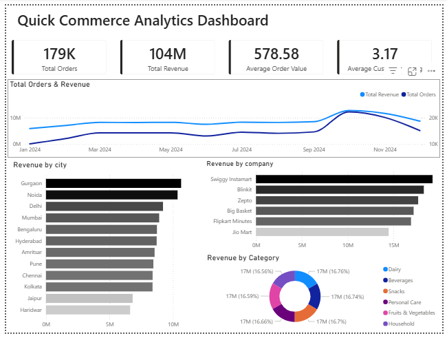
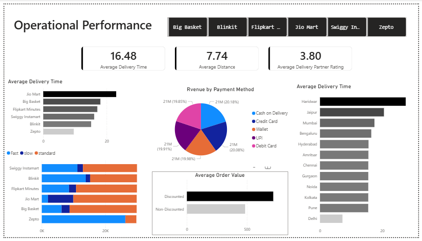

# Quick Commerce Analytics Dashboard

### End-to-end data analytics project | Excel · PostgreSQL · Power BI

---
In this project:
- Raw data was cleaned in Excel power query.
- The cleaned data was loaded into PostgreSQL.
- A Power BI dashboard was created to study orders, revenue, delivery performance, and customer patterns.

## Tools Used
- Excel
- PostgreSQL
- Power BI
- Claude (for research and analysis)

## Dataset
- Total Orders: 179,380
- Time Period: January 2024 to December 2024
- Platforms: Blinkit, Zepto, Swiggy Instamart, Big Basket, Flipkart Minutes, Jio Mart
- Cities: 12 Indian cities
- Categories: Beverages, Dairy, Snacks, Personal Care, Fruits & Vegetables, Household

## Dashboard
The dashboard has 2 pages:
### Page 1 — Executive Overview
  
  
### Page 2 — Operational Performance

## Project Files
Quick-Commerce-Analytics/
│
├── README.md
├── data/
│   ├── qc_Raw_data_latest.csv        
│   └── QC_CleanedData.csv           
├── sql/
│   └── quick_commerce.sql      
├── powerbi/
│   └── QuickCommerce_data.pbix      
└── images/
    ├── dashboard_overview.png       
    └── dashboard_operations.png 

## Key Insights
- Zepto had the fastest average delivery time.
- Discounted orders had a higher average order value than non-discounted orders.
- October and November had higher orders and revenue compared to other months.
- Swiggy Instamart generated the highest revenue.
- Gurgaon and Noida performed strongly in total revenue.

## Future Enhancements
- Add more SQL queries and analysis
- Improve dashboard design further
- Use a larger or real-world dataset
- Add more business questions and deeper insights

